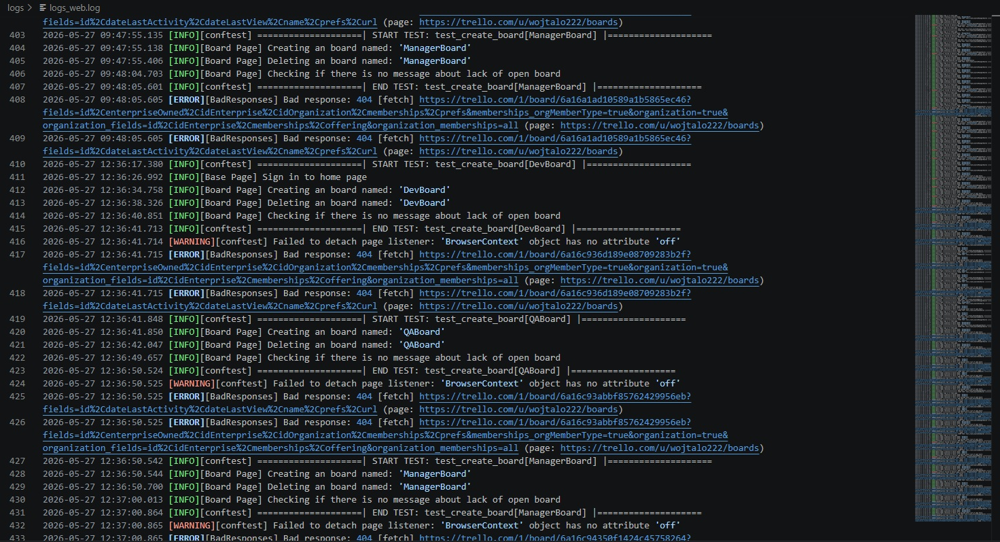
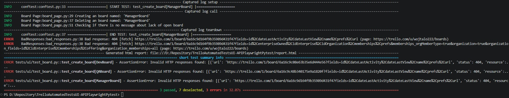
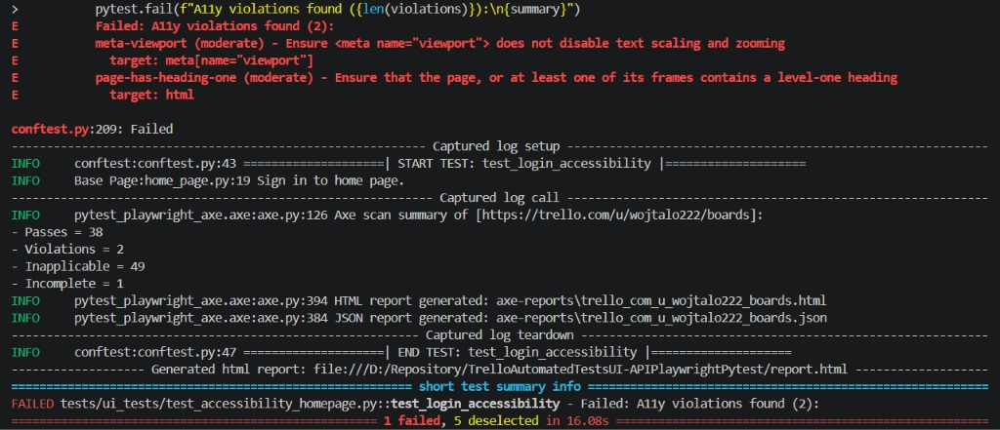
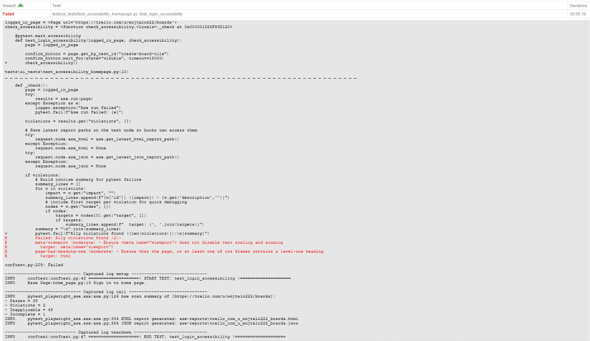
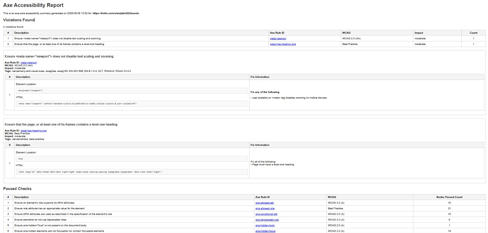
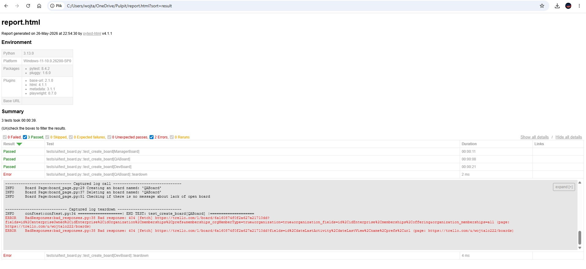
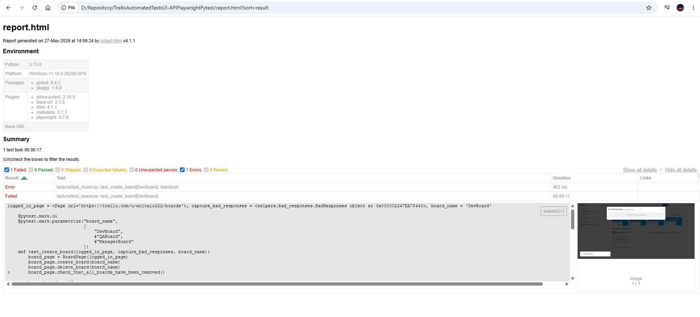
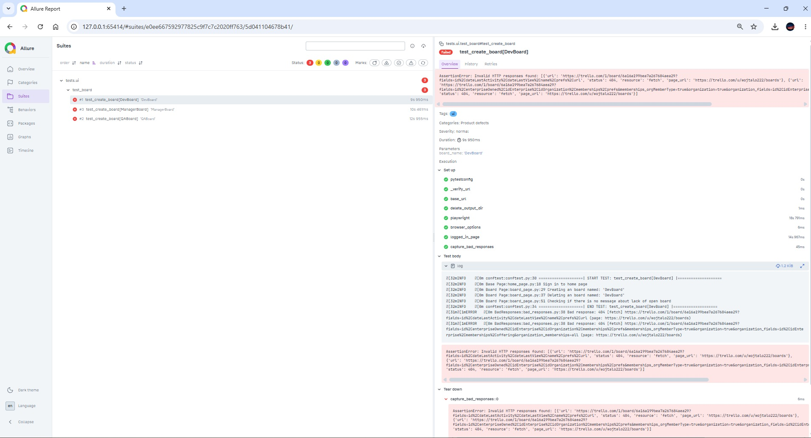

# Test Automation Framework — Python + Playwright

## Requirements:

`Python` installed, preferably version 3.13

## Installation (run everything in the main project folder):

```bash
C:\...\Python313\python -m venv .venv
.venv\Scripts\activate
python.exe -m pip install --upgrade pip
py -m pip install -r requirements.txt
```

## Running all tests:

```bash
.venv\Scripts\python.exe -m pytest
```

## Run the selected test (with the smoke marker):

```bash
.venv\Scripts\python.exe -m pytest -m smoke
```

# Description

Automated test framework created for modern web application testing using `Python` and `Playwright`.
The project focuses on scalable architecture, maintainability, readable logs, `UI`, `API` and hybrid `UI&API` testing.

## Project Goals

This framework is designed to provide:

- scalable automation architecture
- maintainable test code
- stable execution
- readable diagnostics
- efficient hybrid testing strategies
- production-ready automation practices

## Tech Stack

- `Python` 3.13
- `Playwright`
- `Pytest`
- Python `requests`
- HTML reporting `pytest-html`
- `python-dotenv`
- `Logging` architecture
- `YAML` configuration
- `logging-based` diagnostics
- `POM` - Page Object Model
- pure `UI`, pure `API` and Hybrid `UI+API` testing

## UI Testing with Playwright

The framework uses `Playwright` for fast and reliable browser automation.

Features include:

- modern locator strategy
- auto-waits
- multi-page handling
- browser context isolation
- developer-console network monitoring
- scalable fixture architecture

## API Testing with Requests

`API` tests are implemented using Python `requests`, independent from the `UI` layer.

Benefits:

- lightweight API validation
- faster execution
- clean separation between frontend and backend testing
- easier debugging and maintenance

## Hybrid UI + API Testing

The framework supports:

- pure `UI` tests
- pure `API` tests
- hybrid `UI+API` scenarios

This allows:

- backend state preparation through API
- faster end-to-end execution
- reduced UI dependency
- more stable test suites

## Architecture

Page Object Model (POM)

The project follows the Page Object Model architecture pattern:

- tests are separated from page logic
- locators are centralized
- reusable components improve maintainability
- easier scalability for large projects

## Browser Error Monitoring

The framework includes custom response monitoring for detecting:

- HTTP 4xx responses
- HTTP 5xx responses
- frontend/backend communication issues

Even if the UI test itself passes, the framework additionally reports hidden application problems found during execution.

This helps detect:

- broken API calls
- missing resources
- unexpected backend errors
- silent frontend issues

## Real-Time Logging

The framework heavily utilizes Python `logging`:

```python
import logging
```



Features:

- centralized `logging` architecture
- live console logs using `log_cli`
  
- debug-friendly execution flow
- easier CI/CD diagnostics
- structured runtime information

## Accessibility tests (axe)

Accessibility tests are performed at the view and component levels. There shouldn't be too many of them due to instability.

```python
pytest-playwright-axe
```

They check pages and subpages such as:

- login
- dashboard
- board
- card modal
- settings
- search
- notifications

I also added:

- automatic reporting of `Axe` test failures in pytest when violations occur:
  
- adding `Axe` violations to the `pytest-html` report:
  
- generation of `Axe` reports:
  

## Advanced HTML Reporting

Test reports (configured in `pytest.ini`) are generated using:

```ini
addopts = --html=report.html --self-contained-html
```

You don't need to generate a report as you would in `Allure`, the `report.html` file appears automatically in the root directory, all you have to do is run the tests.



The report contains:

- passed/failed/skipped tests (as well as additional statuses Expected failures, Unexpected passes, Errors, and Reruns.)
- execution details
- logs
- additional browser error tracking (In the photo above, the test passed because it verified the main requirements: creating and deleting an table.
  However, during the test, an Error: 404 appeared in the console, which my bad_responses method in the teardown caught. The test is marked as “pass,” which is true, but it also contains an error, which is clearly visible in this report. In Allure, this isn’t split into “pass/fail + error”; there’s only “fail/pass,” which I think is a plus for the pytest report, because it makes the report easier to read.)
- additional attachments, such as screenshots:
  

In addition, the current repository is also configured for the `Allure` report:


## Debug Browser Configuration

Debug Browser Configuration are stored in:

```yaml
debug_browser_config.yaml
```

Settings used only for local debugging and test development:

- `headless` – enables visible browser mode
- `slow_mo` – slows down execution for easier observation

## Pytest Configuration

Test framework settings are defined in:

```ini
pytest.ini
```

This file controls test execution options, reporting, logging, and test categorization.

### Current configuration

- `addopts` – default command-line options for test runs
  - HTML report generation (`--html=report.html --self-contained-html`)
  - optional Allure reporting (`--alluredir=allure-results`, currently disabled)

- `log_cli` – enables real-time logging output in the console

### Test markers

Tests are grouped using custom markers:

- `ui` – tests related only to the UI layer
- `api` – tests related only to the API layer
- `ui_and_api` – tests combining UI and API flows
- `smoke` – smoke tests for quick validation of core functionality
- `accessibility` – accessibility tests using axe-core (WCAG validation)

## Environment Variables

Sensitive and environment-specific data are stored securely in:

```env
.env
```

Example data:

```env
BASE_URL=https://trello.com/
TRELLO_API_KEY=
TRELLO_API_TOKEN=
EMAIL=
PASSWORD=
```

For `TRELLO_API_TOKEN` you can go to: https://trello.com/1/authorize?expiration=never&name=MyApp&scope=read,write&response_type=token&key=YOUR_API_KEY
